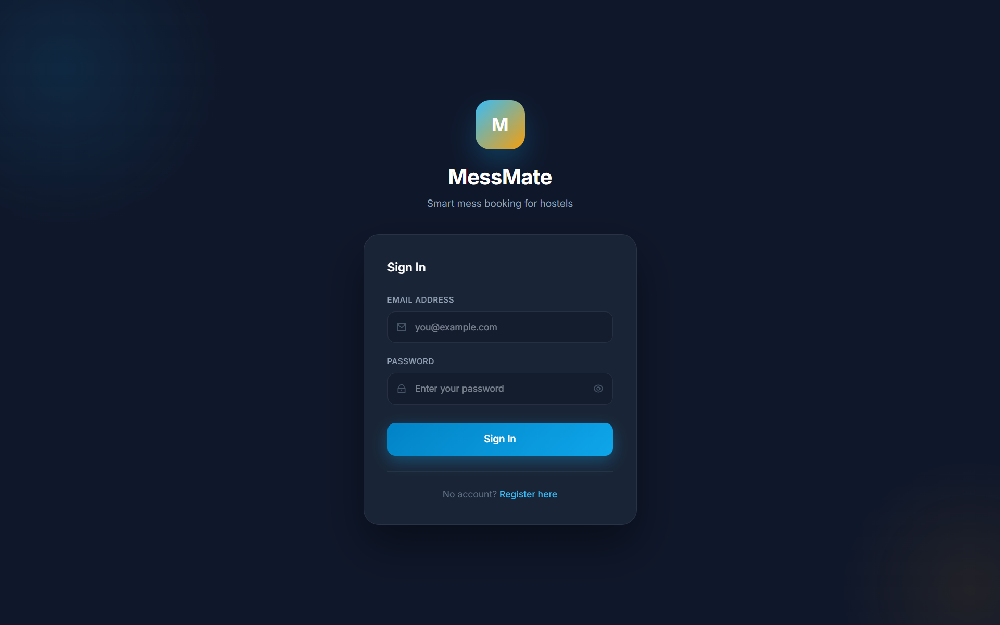
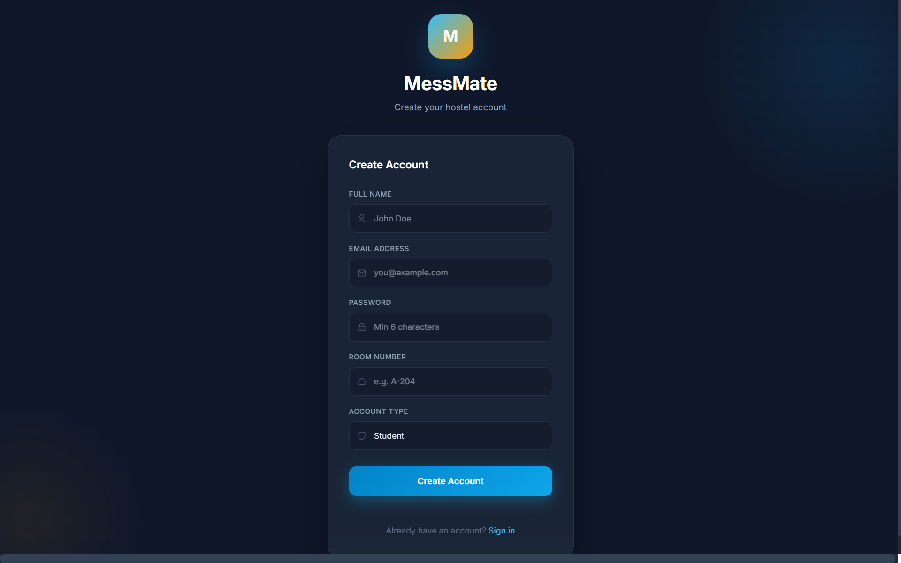
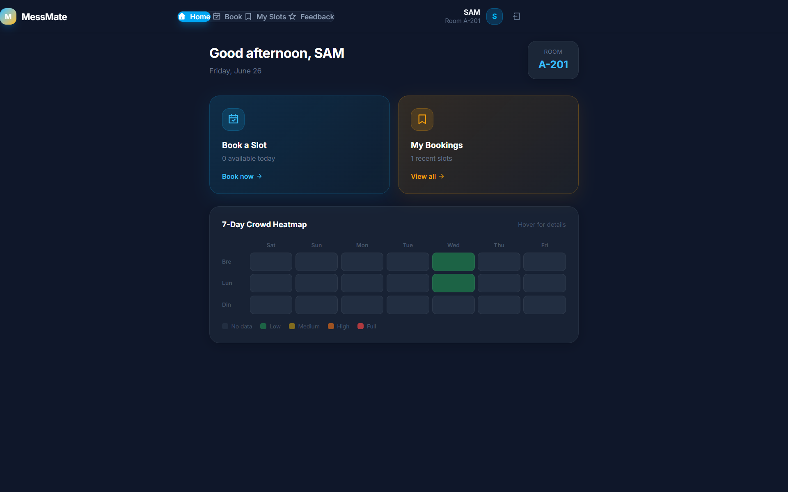
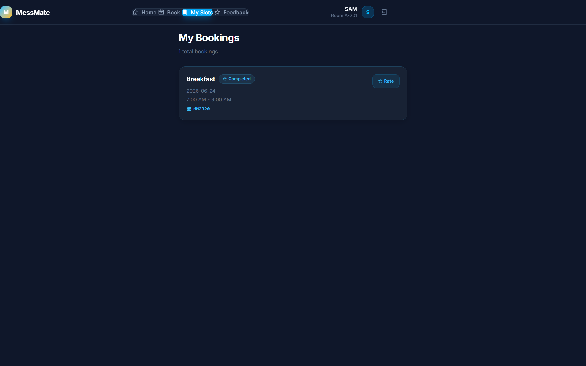

# MessMate

MessMate is a full-stack MERN hostel mess slot booking system built to eliminate long queues, overcrowded dining halls, and zero meal visibility that students face daily in hostels. It brings structure to mess management by letting students book meal slots in advance, track real-time seat availability, and get automatically promoted from a waitlist when someone cancels — all through a clean, modern web interface.

## Overview

- 7-Day Crowd Heatmap for visualizing meal demand patterns across breakfast, lunch, and dinner
- Automated Waitlist System that promotes users on cancellation or no-show using scheduled cron jobs
- Feedback System with multi-factor ratings including taste, hygiene, quantity, and service with admin analytics dashboard
- The application supports two roles. Students can browse available breakfast, lunch and dinner slots, book seats, view their booking history with unique token numbers, and rate meals after completion. Admins get a dedicated panel to create and manage slots, manually check in students, monitor all bookings by date, and view aggregated meal feedback analytics across taste, hygiene, quantity and service.






## Tech Stack

Backend
- Node.js + Express.js
- MongoDB + Mongoose v8
- JWT Authentication
- bcryptjs
- node-cron (automated waitlist promotion)

Frontend
- React 19 + Vite 6
- Tailwind CSS v4
- Motion v12
- React Router v7
- Axios

## Project Structure
```
MessMate/
├── server/
│   ├── config/
│   ├── middleware/
│   ├── models/
│   ├── routes/
│
├── client/
│   ├── src/
│   │   ├── api/
│   │   ├── components/
│   │   ├── context/
│   │   ├── pages/
│
├── README.md
├── .gitignore
└── LICENSE
```

## Prerequisites

- Node.js v18 or higher
- MongoDB (local or Atlas)
- Git

## Getting Started

### Clone Repository
```
git clone https://github.com/samoff04/MessMate.git
cd MessMate
```
### Backend Setup
```
cd server
npm install
Create .env file
PORT=5000
MONGO_URI=mongodb://localhost:27017/messmate
JWT_SECRET=your_secret_key
NODE_ENV=development

Run backend
npm run dev
```
### Frontend Setup
```
cd ../client
npm install
npm run dev

Application runs at
http://localhost:5173
```

## API Endpoints

Auth
- POST /api/auth/register
- POST /api/auth/login
- GET /api/auth/me

Slots
- GET /api/slots
- POST /api/slots
- GET /api/slots/heatmap

Bookings
- POST /api/bookings
- PUT /api/bookings/:id/cancel
- PUT /api/bookings/:id/checkin
- GET /api/bookings/my

Feedback
- POST /api/feedback
- GET /api/feedback/admin/stats

## Scripts

Backend
npm run dev
npm start

Frontend
npm run dev
npm run build
npm run preview

## Highlights

- Role-based authentication system (Admin and Student)
- Automated queue management using cron jobs
- Real-time analytics for mess usage patterns
- Modular and scalable MERN architecture
- Production-ready backend and frontend structure

## Future Improvements

- Email and SMS notifications for booking confirmation and waitlist promotion
- QR code based check-in scanner for admins instead of manual check-in
- Monthly meal subscription plans with auto-booking for regular students
- Push notifications via PWA for slot availability alerts
- Mess menu management with weekly meal planner for admins
- AI based crowd prediction using historical booking patterns

## License

This project is licensed under the MIT License.

## Author

Samarth Varshney